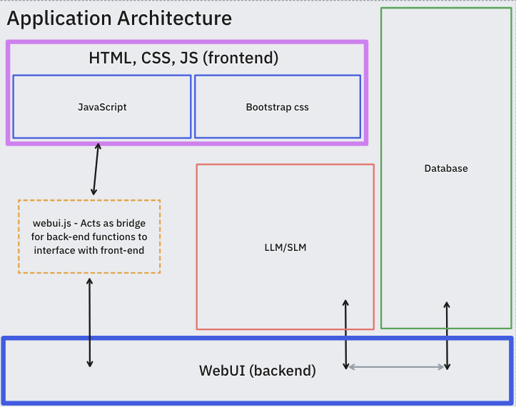

# SeniorProject4360
Senior Project - Machine Learning and Optical Character Recognition for Document Processing in Supply Chain Logistics


## Architecture Overview



## How to build executable:
switch out the root folder in main.py main function!!!
```_internal/views```
```sh
pyinstaller --collect-all webui --add-data "views:views" --add-data "database:database" --add-data "OCR:OCR" -n DocHelp main.py
```
